# Oakley-App

Oakley is a modern furniture shopping mobile application built using Flutter and Firebase. The app provides a clean and responsive user interface that allows users to explore different furniture products, view detailed information, and add items to their shopping cart.

## 🎥 Demo Video
[Watch Demo](https://drive.google.com/file/d/1zbKgg3flzAYOkrW6Rdjkgf0I-mdXv712/view)

---

## 📱 Screenshots

### Onboarding Screens

  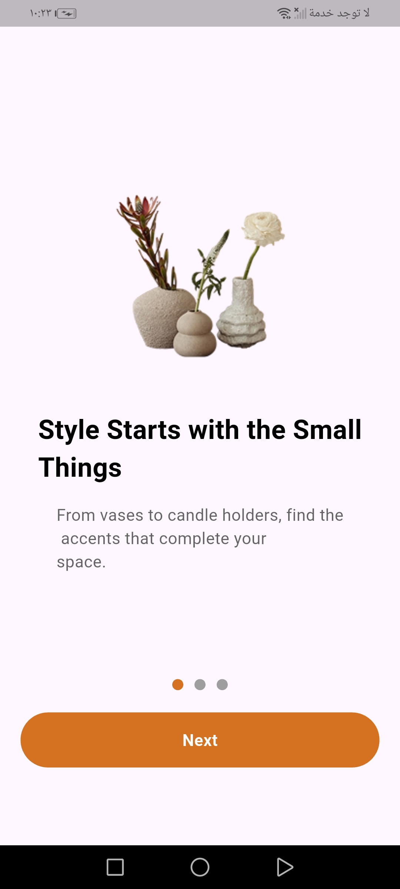
  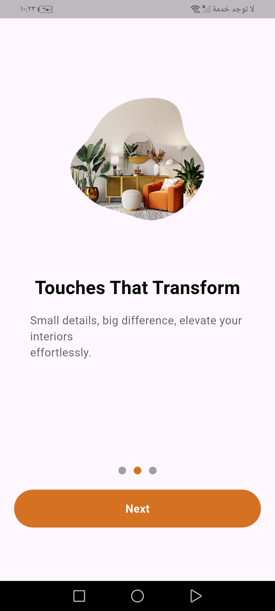
  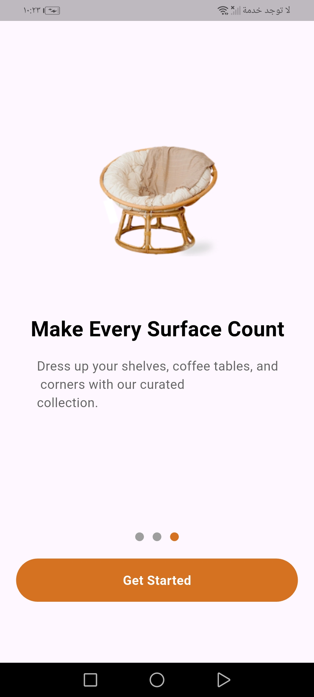

### Authentication

  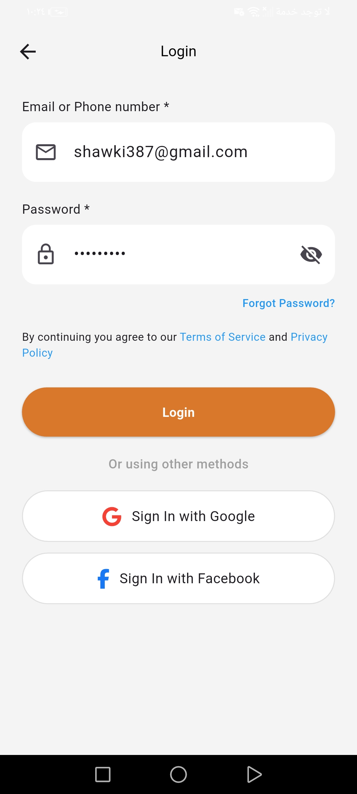
  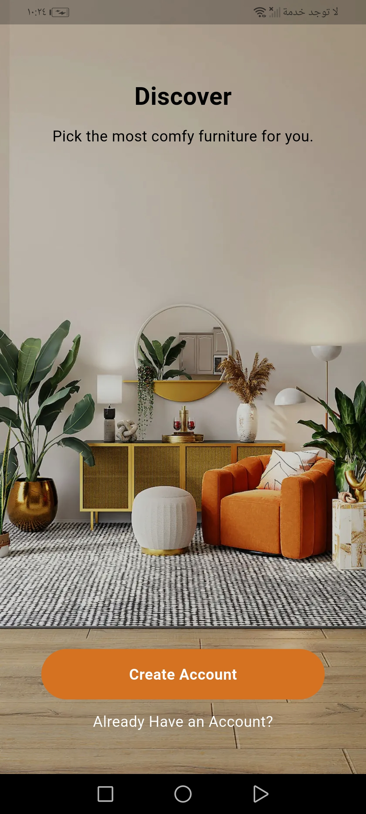
  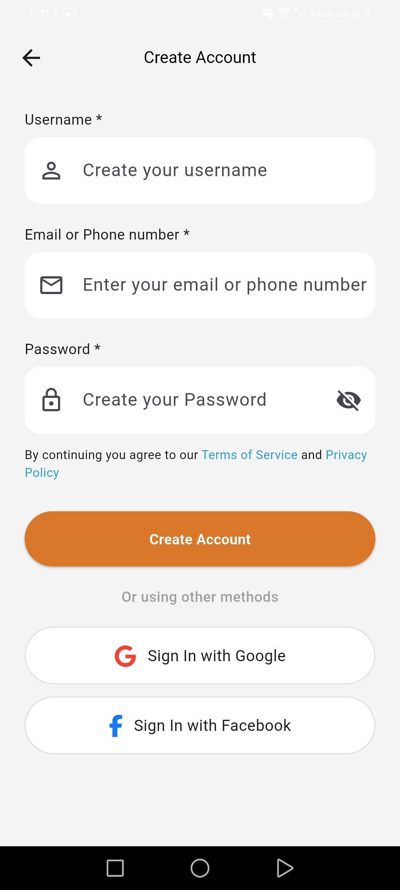

### Home Screens

  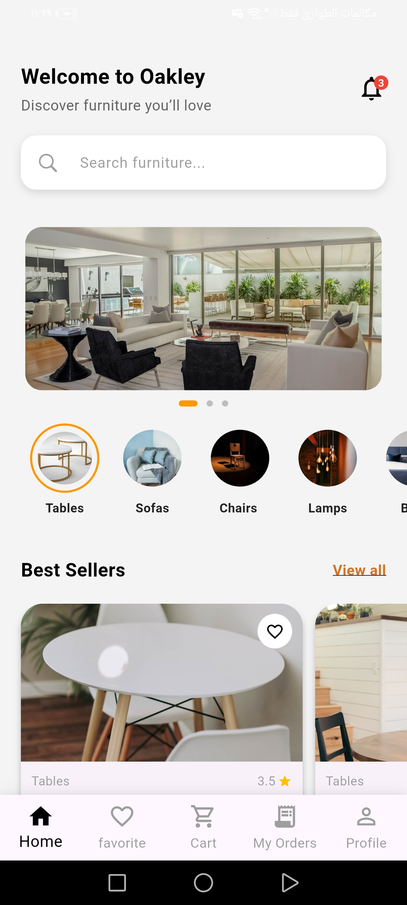
  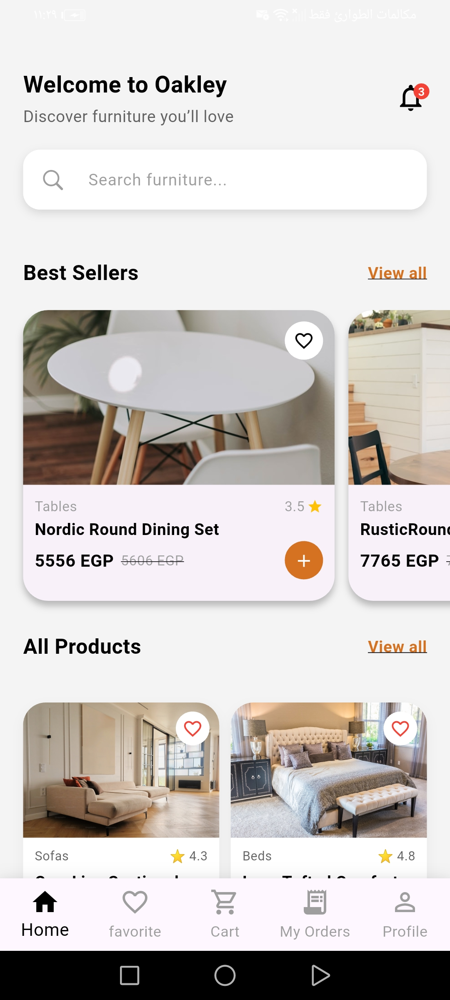
  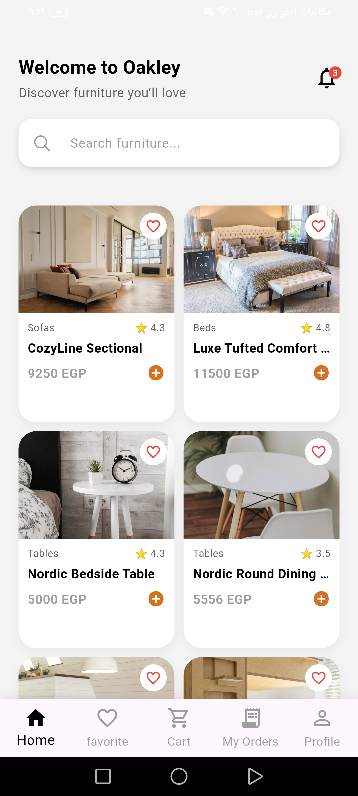

### Product Details

  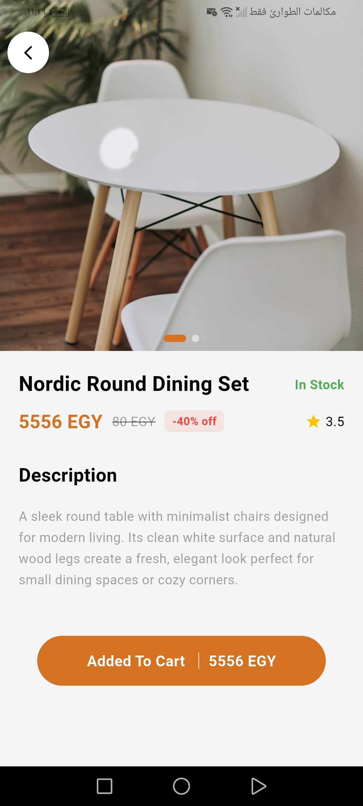

### Favorites

  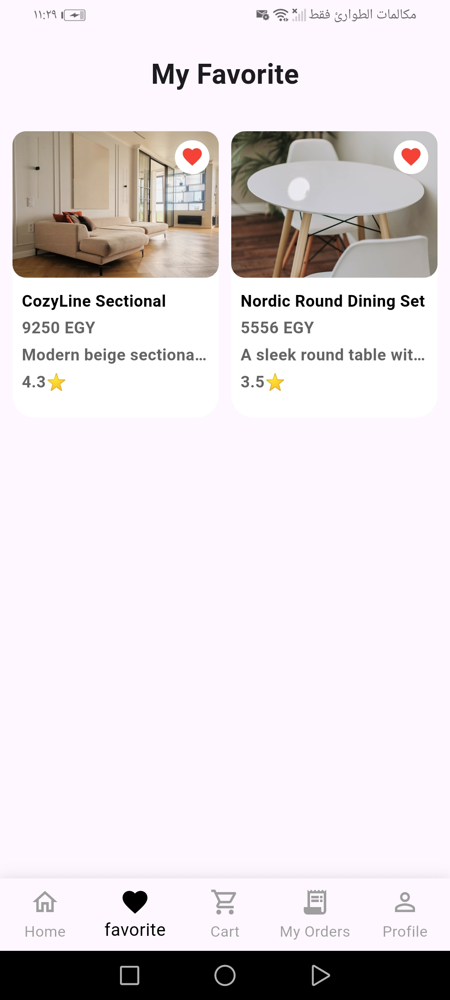

### Cart

  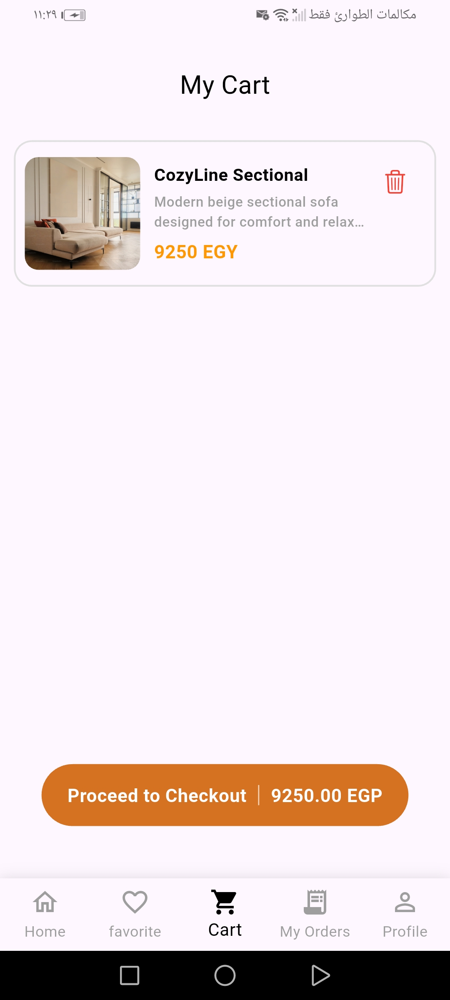

### Payment

  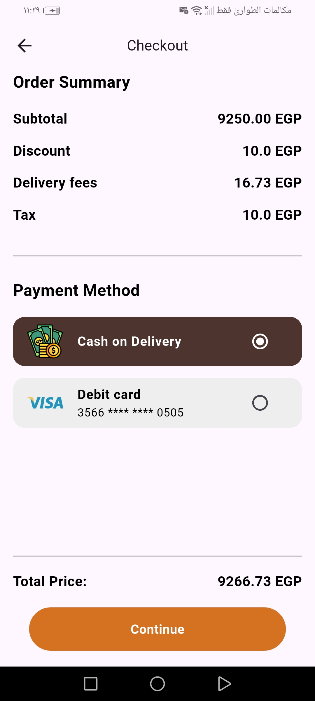

### Profile & History

  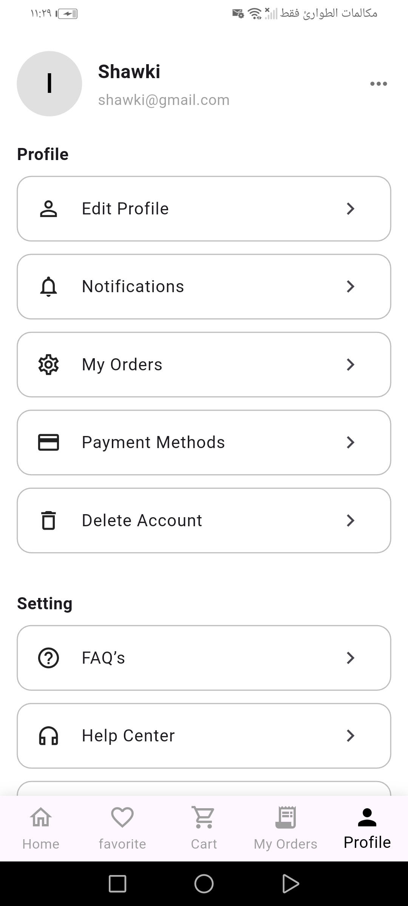
  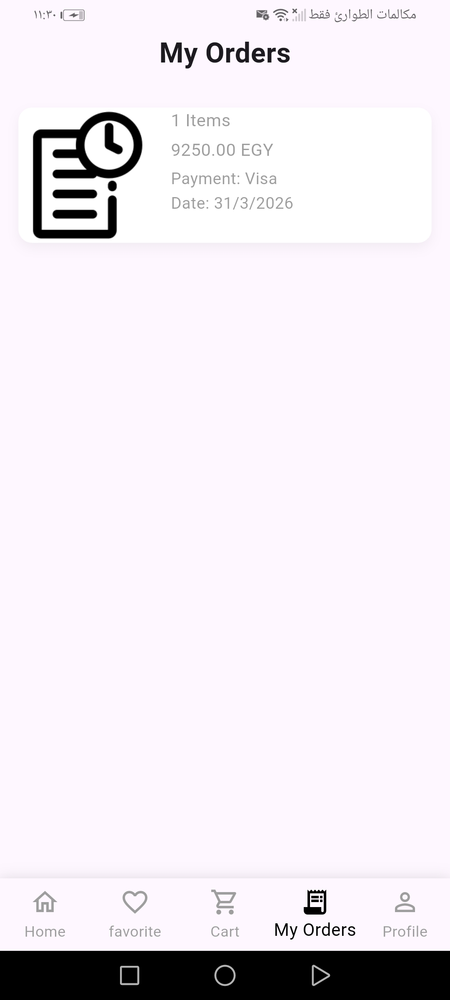

### Logout

  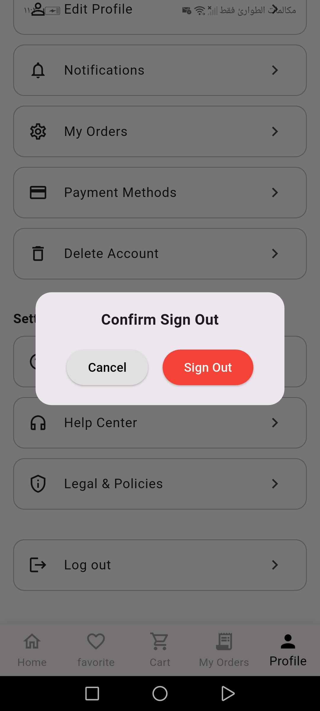

---

## Getting Started

This project is a starting point for a Flutter application.

A few resources to get you started if this is your first Flutter project:

- [Lab: Write your first Flutter app](https://docs.flutter.dev/get-started/codelab)
- [Cookbook: Useful Flutter samples](https://docs.flutter.dev/cookbook)

For help getting started with Flutter development, view the
[online documentation](https://docs.flutter.dev/), which offers tutorials, samples, guidance on mobile development, and a full API reference.
